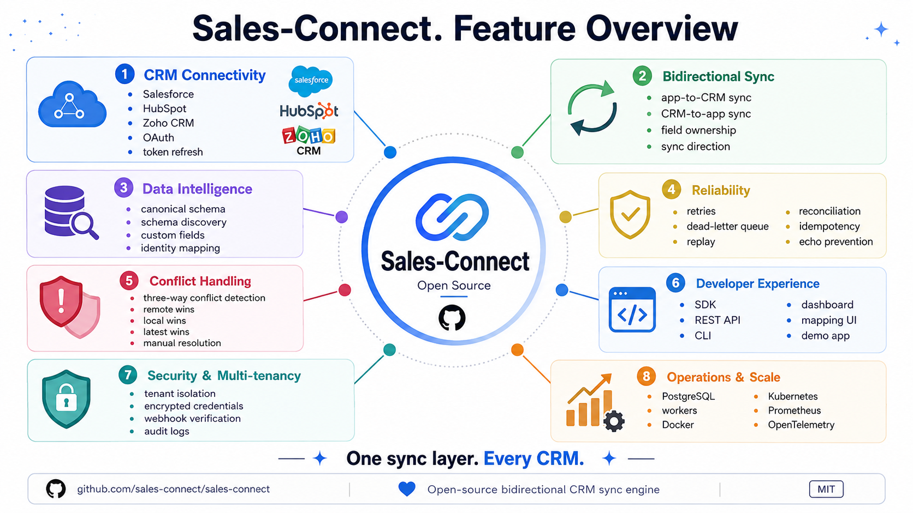
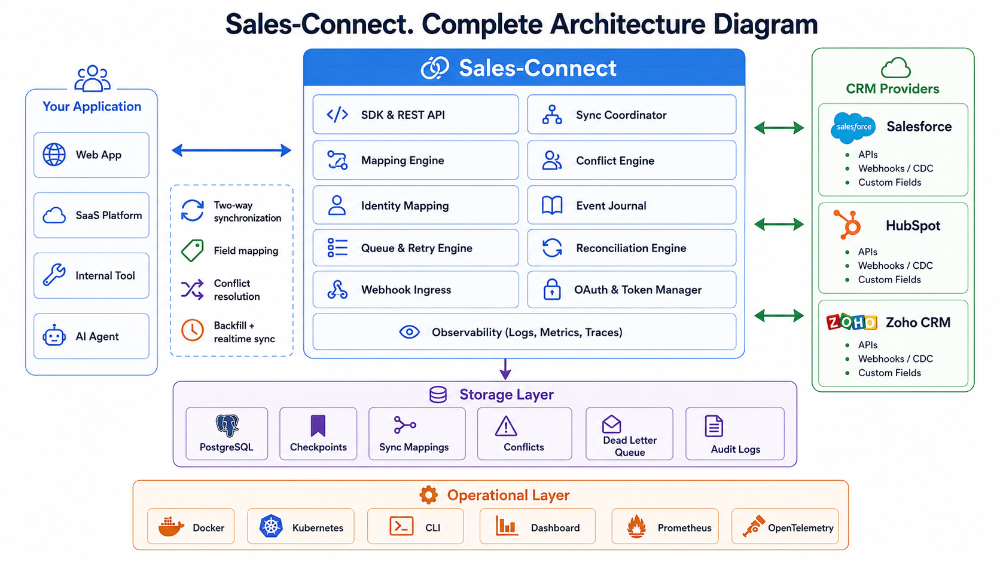
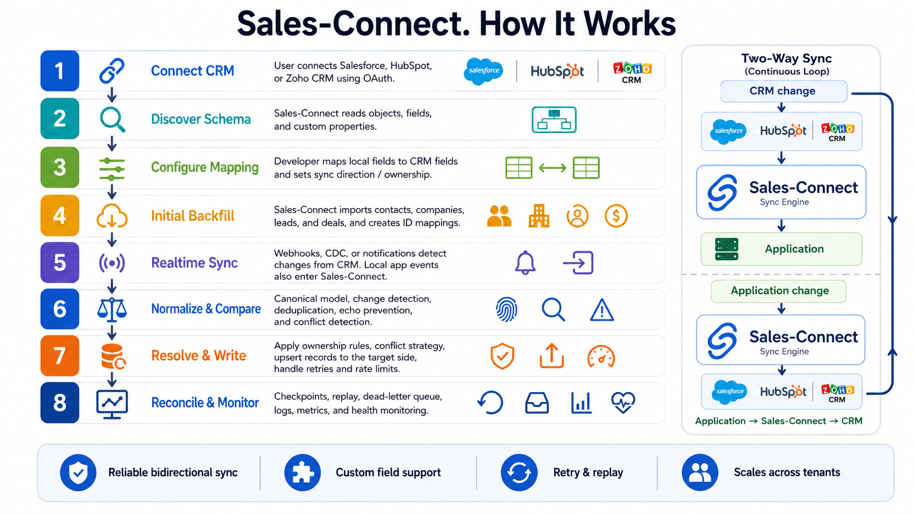

# Sales-Connect

**Open-source bidirectional CRM synchronization framework for Salesforce, HubSpot and Zoho CRM.**

Sales-Connect gives SaaS products and internal applications a reusable sync layer instead of three separate CRM integrations. It combines OAuth, canonical records, provider-specific field mapping, local↔remote identity, event journaling, durable retries, three-way conflict detection, echo-loop suppression, resumable backfills, incremental reconciliation and webhook ingestion.

> One sync layer. Every CRM.



## What is included

- `@sales-connect/types` . canonical CRM types and provider contract
- `@sales-connect/core` . bidirectional sync engine
- `@sales-connect/storage-postgres` . PostgreSQL persistence and schema
- `@sales-connect/queue-postgres` . durable pg-boss worker queue
- `@sales-connect/provider-salesforce` . REST CRUD, describe/schema, external-ID upsert and SystemModstamp reconciliation
- `@sales-connect/provider-hubspot` . OAuth v3, CRM objects, property discovery, batch upsert, search reconciliation and v3 webhook verification
- `@sales-connect/provider-zoho` . CRM API V8, metadata, upsert, notification parsing and resumable pagination
- `@sales-connect/sdk` . HTTP client SDK
- `@sales-connect/cli` . operational CLI
- `@sales-connect/testkit` . in-memory queue/storage and mock CRM provider
- `apps/server` . Fastify API + workers
- `apps/dashboard` . developer operations dashboard
- `apps/demo-nextjs` . two-way contact synchronization demo
- Docker Compose, Kubernetes examples, CI, migrations and production operations docs

## Core architecture



```text
Your application / local data
            ⇅
      Sales-Connect Core
      ├─ ID mapping
      ├─ field direction
      ├─ field ownership
      ├─ three-way conflicts
      ├─ event journal
      ├─ echo suppression
      ├─ retry / dead-letter
      ├─ backfill checkpoints
      └─ reconciliation
            ⇅
       Provider contract
       ├─ Salesforce
       ├─ HubSpot
       └─ Zoho CRM
```

The framework does not force your application to use Sales-Connect as its primary database. `ApplicationAdapter` can be implemented for your own database/API. The standalone server includes a PostgreSQL-backed reference local record adapter so the project can run immediately.

## How it works



## Quick start

Requirements:

- Node.js 20+ (Node.js 22 recommended)
- PostgreSQL 16+
- OAuth credentials for at least one CRM provider

```bash
cp .env.example .env
openssl rand -hex 32
# Put the generated value in SALES_CONNECT_MASTER_KEY.

npm install
npm run build

docker compose up -d postgres
npm run db:migrate
npm run dev:server
```

In another terminal:

```bash
SALES_CONNECT_URL=http://localhost:4380 \
SALES_CONNECT_API_KEY=change-me \
SALES_CONNECT_TENANT=demo \
npm run dev:dashboard
```

Dashboard: `http://localhost:3000`

Demo app:

```bash
npm run dev:demo
```

Demo: `http://localhost:3001`

## Docker Compose

After configuring `.env`:

```bash
docker compose up --build
```

The server image runs the idempotent PostgreSQL migration before starting the API.

## Connect a CRM

Create a connection:

```bash
curl -X POST http://localhost:4380/v1/connections \
  -H 'content-type: application/json' \
  -H 'x-sales-connect-key: change-me' \
  -H 'x-sales-connect-tenant: demo' \
  -d '{"provider":"hubspot","name":"Demo HubSpot"}'
```

Then request its authorization URL:

```bash
curl -X POST http://localhost:4380/v1/connections/CONNECTION_ID/authorize \
  -H 'x-sales-connect-key: change-me' \
  -H 'x-sales-connect-tenant: demo'
```

OAuth state is random, hashed at rest, expires after ten minutes and can be consumed only once.

## Configure synchronization

Provider field names stay outside the core engine. A HubSpot contact mapping can look like:

```json
{
  "entity": "contact",
  "remoteObject": "contacts",
  "direction": "bidirectional",
  "conflictStrategy": "field_owner",
  "deletePolicy": {
    "remoteToLocal": "soft_delete",
    "localToRemote": "archive"
  },
  "externalIdField": "email",
  "mappings": [
    { "local": "firstName", "remote": "firstname", "owner": "shared" },
    { "local": "lastName", "remote": "lastname", "owner": "shared" },
    { "local": "email", "remote": "email", "owner": "remote" },
    { "local": "usageScore", "remote": "product_usage_score", "direction": "local_to_remote", "owner": "local" }
  ]
}
```

Salesforce and Zoho examples are under `examples/mappings/`.

The API validates configured remote fields against live provider metadata before creating a new immutable mapping version.

## Application API

```ts
import { SalesConnectClient } from '@sales-connect/sdk';

const sales = new SalesConnectClient({
  baseUrl: 'https://sync.example.com',
  tenantId: 'acme',
  apiKey: process.env.SALES_CONNECT_API_KEY!
});

await sales.records.upsert('con_123', 'contact', {
  id: 'usr_42',
  fields: {
    firstName: 'Ada',
    lastName: 'Lovelace',
    email: 'ada@example.com',
    usageScore: 87
  }
});
```

The same local call can target Salesforce, HubSpot or Zoho based on the connection.

## Bidirectional conflict model

Sales-Connect stores the last common synchronized snapshot for each mapped record. Before overwriting either side it compares:

```text
last common state
      ↙      ↘
local now   remote now
```

A field is considered a true conflict only when both sides changed that field differently since the common snapshot.

Supported policies:

- `field_owner`
- `local_wins`
- `remote_wins`
- `latest_wins`
- `manual`
- custom resolver extension point in embedded deployments

Shared/manual conflicts are persisted in `sc_conflicts` and surfaced in the dashboard/API.

## Reliability model

Sales-Connect uses **effectively-once** processing semantics rather than claiming impossible distributed exactly-once transactions.

- immutable event journal before processing
- deterministic event IDs when provider IDs exist
- unique local↔remote identity mappings
- provider upsert support where available
- outbound write fingerprints to suppress webhook echoes
- pg-boss exponential retries
- explicit `dead_letter` event status after retry exhaustion
- manual event replay
- resumable historical backfills
- incremental reconciliation with overlap windows
- durable provider pagination cursors
- background workers carry tenant identity on every job

## Webhooks and real-time updates

Endpoint:

```text
POST /v1/webhooks/:tenantId/:connectionId/:provider
```

- HubSpot uses v3 HMAC signature verification over the raw request body.
- Zoho notification ingress uses the generated per-connection webhook secret in the reference implementation.
- Salesforce Change Data Capture can be consumed by a Pub/Sub relay and posted to the same endpoint using the connection webhook secret. REST/SystemModstamp reconciliation remains the recovery path.

Normalized application-facing events can also be delivered to `WEBHOOK_TARGET_URL`. Delivery is queued durably and retried. Signatures use HMAC-SHA256 with `WEBHOOK_SIGNING_SECRET` over `<timestamp>.<raw-json-body>`.

## Backfill and reconciliation

Historical import:

```bash
sales-connect backfill con_123 contact
```

Incremental recovery scan:

```bash
sales-connect reconcile con_123 contact
```

Each provider persists its pagination continuation token/cursor. Reconciliation automatically overlaps the previous window to recover delayed or missing events.

## Security

- AES-256-GCM encrypted OAuth token sets
- automatic token refresh
- hashed single-use OAuth state
- server-side provider credentials only
- tenant-scoped API/storage operations
- raw-body HubSpot signature verification
- per-connection ingress secrets for providers without equivalent verification in the reference adapter
- dashboard server-side proxy keeps the admin API key out of browser JavaScript
- connection list/read APIs redact encrypted credentials and secret-like config values
- audit log for connection/mapping/sync/conflict actions

The bundled global server API key is a self-hosting bootstrap. A hosted multi-user product should replace it with its own authenticated tenant membership/RBAC layer.

## Observability

- structured Fastify/Pino logs
- `/health`
- `/ready`
- `/metrics`
- Prometheus process and sync metrics
- event journal and conflict inspection
- dashboard event/conflict view

## Adding another CRM

Implement `CRMProvider` from `@sales-connect/types`:

```ts
interface CRMProvider {
  capabilities(): ProviderCapabilities;
  getAuthorizationUrl(...): string;
  exchangeAuthorizationCode(...): Promise<TokenSet>;
  refreshToken(...): Promise<TokenSet>;
  discoverObjects(...): Promise<ObjectSchema[]>;
  discoverFields(...): Promise<FieldSchema[]>;
  getRecord(...): Promise<RemoteRecord>;
  listRecords(...): Promise<ListPage>;
  createRecord(...): Promise<RemoteRecord>;
  updateRecord(...): Promise<RemoteRecord>;
  upsertRecord(...): Promise<RemoteRecord>;
  deleteRecord(...): Promise<void>;
  normalize(...): Promise<CanonicalRecord>;
  denormalize(...): Promise<Record<string, unknown>>;
}
```

Future connectors can add Dynamics 365, Pipedrive, Freshsales, Close, Copper and other CRMs without modifying core sync semantics.

## Repository layout

```text
sales-connect/
├── apps/
│   ├── server/
│   ├── dashboard/
│   └── demo-nextjs/
├── packages/
│   ├── types/
│   ├── core/
│   ├── storage-postgres/
│   ├── queue-postgres/
│   ├── provider-common/
│   ├── provider-salesforce/
│   ├── provider-hubspot/
│   ├── provider-zoho/
│   ├── sdk/
│   ├── cli/
│   └── testkit/
├── examples/
├── deploy/kubernetes/
├── docs/
├── docker-compose.yml
└── .github/workflows/ci.yml
```

## Validation

CI is configured to install dependencies, build all workspaces, run tests and type checks, and run the PostgreSQL migration against a real PostgreSQL service.

## Documentation

- `docs/ARCHITECTURE.md`
- `docs/API.md`
- `docs/PROVIDER_SETUP.md`
- `docs/SECURITY.md`
- `docs/OPERATIONS.md`
- `docs/CONNECTOR_KIT.md`

## License

Apache License 2.0.
